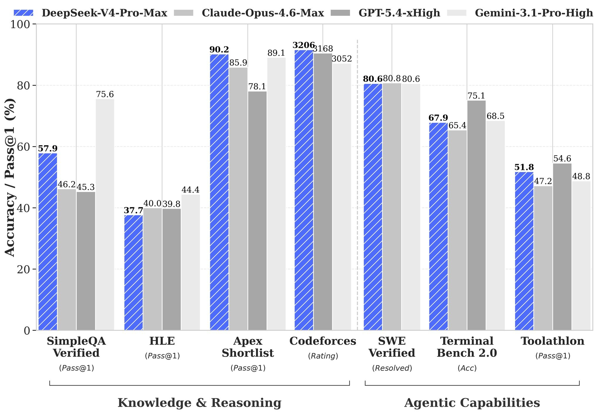

# DeepSeek V4 Claude Code MCP — Cut Your Claude Code & Cursor Token Bills by 10–100× with DeepSeek V4's 1M Context
 
**The free, open-source MCP server that pairs DeepSeek V4 with Claude Code, Cursor, and OpenAI Codex — slashing their token bills by 10–100× while letting you chat with your entire codebase locally.** Point DV4-MCP at your project folder. DeepSeek V4's 1-million-token context reads the whole repo in one shot — no RAG chunking, no vector embeddings, no missed cross-file links. Then your existing AI coding agent stops re-reading files every session and asks DV4-MCP for surgical context packets instead. The same Claude Code session that used to burn 120,000 tokens now burns 10,000. Your code never leaves your machine. One-click installer for Windows and Mac, no Python, no Docker, no account.
 

  

[Install](#install) · [How it works](#how-it-works) · [Comparison](#comparison) · [FAQ](#faq) · [Roadmap](#roadmap)
 
---
 
## Why DV4-MCP exists
 
AI coding agents in 2026 have a billing problem. Claude Code, Cursor, and OpenAI Codex are brilliant at writing code — but every session starts blind. They read files on demand, re-read the same files across sessions, and rack up monthly bills of $50–$300 for any developer working on a non-trivial codebase. A typical "add a feature" task on a mid-sized TypeScript repo (~180k LoC) burns roughly **120,000 tokens** before a single line of new code gets written — almost all on file exploration the agent did last week too.
 
The other half of the market — RepoMind, Greptile, Cartograph, Cody — solves "chat with your codebase," but charges per repo, requires uploading source code to their servers, and doesn't integrate with the AI coding tools you already pay for.
 
**DV4-MCP is the missing piece.** It indexes your codebase **once**, locally, using DeepSeek V4's 1-million-token context — the whole repo in one prompt, no RAG chunking, no embedding drift. Then it serves precision-targeted context packets to Claude Code, Cursor, or Codex via the Model Context Protocol. Same agent, same workflow — minus the 10–100× token waste. And because everything runs locally, your code stays where it belongs.
 
**What you get:**
 
- **100% free, open-source, MIT licensed** — no subscription, no premium tier, no telemetry
- **DeepSeek V4 with 1M-token context** — whole repo in one prompt, no RAG chunking, no missed cross-file links
- **MCP server for Claude Code, Cursor, Codex, Cline, Continue, Windsurf, Cody** — works with any MCP-compatible agent
- **10–100× fewer tokens** on repo-exploration tasks (measured on real mid-sized codebases)
- **Code stays local** — fits enterprise, NDA, fintech, medtech, defense codebases without legal review
- **One-click signed installer** for Windows and Mac, every dependency bundled
## Install
 
**Windows:** Download `DV4-MCP-Setup.exe` from the [latest release](../../releases/latest) and double-click. Digitally signed, passes SmartScreen.
 
**Mac:** Download `DV4-MCP.dmg`, drag to Applications. Apple Developer ID signed and notarized. Universal binary (Apple Silicon M1–M5, Intel).
 
**60-second setup:** Point DV4-MCP at your project folder. Pick how to access DeepSeek V4 — bundled free-tier proxy (works immediately, no key) or paste your own DeepSeek API key for unlimited use. Enable the MCP server, copy the printed config snippet into Claude Code, Cursor, Codex, Cline, Continue, Windsurf, or Cody. Restart your agent. Done.
 
## How it works
 
DV4-MCP indexes your repo once, keeps the index local and always-current, and exposes it to AI coding agents via the Model Context Protocol. Your agent calls DV4-MCP whenever it needs to understand the codebase. DV4-MCP answers with precision context in **hundreds of tokens, not hundreds of thousands**.
 
### Smart Context Engine — the core differentiator
 
Routes work between two DeepSeek V4 sizes automatically:
 
- **V4-Flash** (284B parameters, 13B active) handles fast lookups, single-file explanations, import-graph queries
- **V4-Pro** (1.6T parameters, 49B active, with Think High and Think Max reasoning modes) handles architectural questions, cross-file refactoring, subtle bug hunts spanning multiple files
For your coding agent, the MCP server exposes three tools:
 
1. `dv4_query` — natural-language Q&A with full repo context
2. `dv4_locate` — rank-ordered file finder with reasoning
3. `dv4_packet` — task-scoped context bundle (files, call graphs, type definitions)
Your agent picks the right tool per task. No per-query configuration.
 
### Why no RAG?
 
Traditional "chat with your repo" tools shatter your codebase into vector embeddings and search by similarity. **Code isn't semantically distributed like prose.** A bug in `auth.service.ts` may live in a type definition three directories away — embedding similarity will never catch it. V4's 1M context lets DV4-MCP skip chunking entirely. Medium codebases fit whole. Large monorepos use dependency-graph file ranking to fill the window with the most relevant code first.
 
### DeepSeek V4 access — free or BYO key
 
The bundled free-tier proxy is enough for personal projects and evaluation. For unlimited use, paste your own DeepSeek API key — at current pricing, even heavy full-time use costs single-digit dollars per month. DeepSeek V4 is the cheapest frontier-grade model on the market.
 
## Comparison
 
| Feature | DV4-MCP | Cursor @codebase | RepoMind / Greptile | Claude Code alone |
|---|---|---|---|---|
| Price | **Free** | $20/mo | Paid tiers | $20–$200/mo usage |
| Code stays local | **Yes** | No | No | Reads local, sends to API |
| 1M context per query | **Yes** | No | Partial | 200K |
| MCP server for agents | **Yes** | No | No | N/A |
| Cuts agent token bills | **10–100×** | N/A | N/A | Baseline |
| Open source | **Yes** | No | Varies | No |
 
**Honest note:** Cursor's in-IDE experience is slicker if you live in Cursor and don't mind the subscription. RepoMind and Greptile have polished web interfaces if cloud upload of your code is acceptable. DV4-MCP wins on cost, privacy, MCP integration, and depth of context — not on IDE polish.
 
## FAQ
 
**Is DV4-MCP free, and how much does DeepSeek V4 actually cost?**

The app is 100% free, MIT licensed, no premium tier. The bundled free-tier proxy gives you immediate V4 access at zero cost. For unlimited use, paste your own DeepSeek API key — even heavy daily use typically costs single-digit dollars per month, because DeepSeek V4 is the cheapest frontier-grade model on the market. The token savings on Claude Code or Cursor more than pay for DeepSeek API costs many times over.
 
**Does my code get uploaded anywhere?**

No. DV4-MCP runs entirely on your machine — the indexer, the database, the MCP server are all local. The only network traffic is V4 prompts going directly from your machine to DeepSeek's API (via the bundled proxy or your own key). DV4-MCP operates no server for your code, stores nothing remotely, and respects `.gitignore` by default. Suitable for proprietary, NDA, fintech, medtech, and defense codebases without legal review.
 
**Is it safe to download? How do I know it's not malware?**

DV4-MCP is MIT licensed with fully auditable source code on GitHub. Releases are code-signed on Windows and notarized with an Apple Developer ID on Mac. SHA-256 checksums are published for every release. Build from source if you want to verify the binary independently. As a 2026 rule: avoid any unsigned or closed-source "DeepSeek V4 installer" — many on the wild are credential stealers. Download DV4-MCP only from the [Releases](,,/,,/releases) page.
 
**How much exactly does it cut my Claude Code or Cursor bill?**

On a representative mid-sized TypeScript project (~1,200 files, ~180k LoC), Claude Code typically burns 120k tokens on a single "add a feature" task — almost all on file exploration. With DV4-MCP serving context via MCP, the same task drops to **8–15k tokens**. Savings are largest on repo-exploration tasks (10–100×) and smaller on pure code-writing tasks where context discovery isn't the bottleneck. Real-world average for active Claude Code users: **70–85% token reduction** across a typical work week.
 
**How is DV4-MCP different from RepoMind, Greptile, or Cursor's @codebase?**

RepoMind and Greptile are cloud-hosted — you upload your source code to their servers to use them, which is a non-starter for proprietary or NDA-bound work. Cursor @codebase is in-IDE only, embeddings-based, and locked behind the Cursor subscription. DV4-MCP is local-first, free, open source, uses V4's 1M context (no RAG chunking), and has the **MCP server that lets your existing AI coding agent use it as a context layer** — none of the others offer that. Different tools for different needs.
 
## Roadmap
 
**v1.1** — Linux packages (.deb, .rpm, AppImage). JetBrains and VS Code extensions with inline answers. Watch mode (live-updating index as you code). Multi-repo projects.
 
**v1.2** — Local model fallback via Ollama for offline use. Custom rules files for project-specific conventions. Git-aware queries.
 
**v2.0** — Self-hosted team edition with shared index. Plugin support for Linear / Jira / Confluence as extra context.
 
## License
 
MIT License. See [LICENSE](LICENSE).
 
## Disclaimer
 
DV4-MCP is an independent open-source project. It is not affiliated with, endorsed by, or sponsored by DeepSeek-AI, Anthropic, OpenAI, or any of the AI coding agents it integrates with. Model and product names ("DeepSeek V4," "Claude Code," "Cursor," "OpenAI Codex," "MCP") are used solely to identify the technologies this client connects to (nominative fair use). When using V4-Pro, your prompts are processed under DeepSeek's standard API privacy and retention policies — DV4-MCP adds no intermediary server and no additional data collection.
 
---
 
**If DV4-MCP saved you tokens, time, or a monthly subscription, please star the repo on GitHub.** It's the only metric we track.
